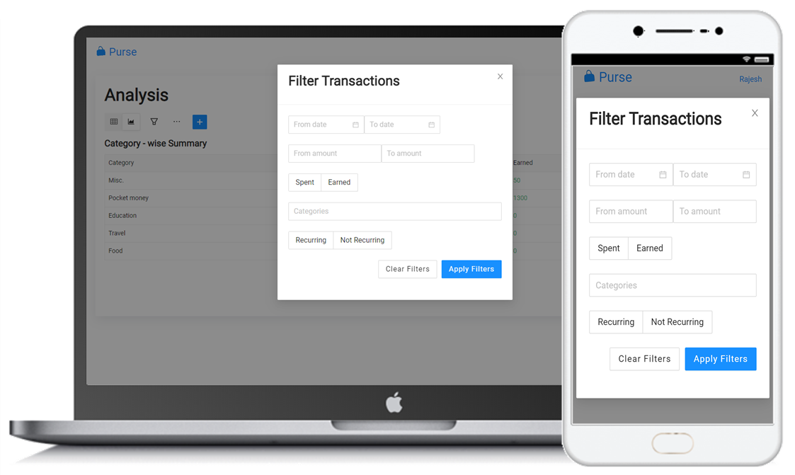

# purse
Track your cash money using Purse.  

- Website for users to manage their cash transactions
- CRUD transactions with custom user-defined Transaction Categories Eg. daily commute expenses, medicine expenses, etc.
- Filter and Sort transactions on date ranges, amount ranges, category filters, etc.
- Category-wise summaries and analysis for user-defined date ranges
- Auth using Bcrypt, JWT Tokens, Validator.js and cookies
- User profile management including reset password with OTP verification
- Email reminders for recurring transactions using Nodemailer and CRON jobs using node-cron
- Chart.js graphs for transaction analysis
- Containerized using Docker
- Mobile – first UI using Ant Design for user friendly UI - UX

## CRUD Transactions  

  

## Filter and Sort Transactions  

  

## Analyze Transactions  

  

And much more........  
